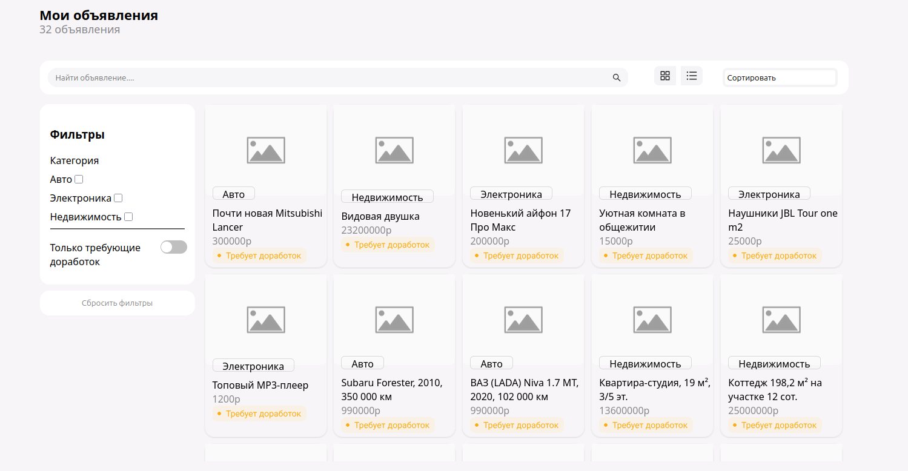
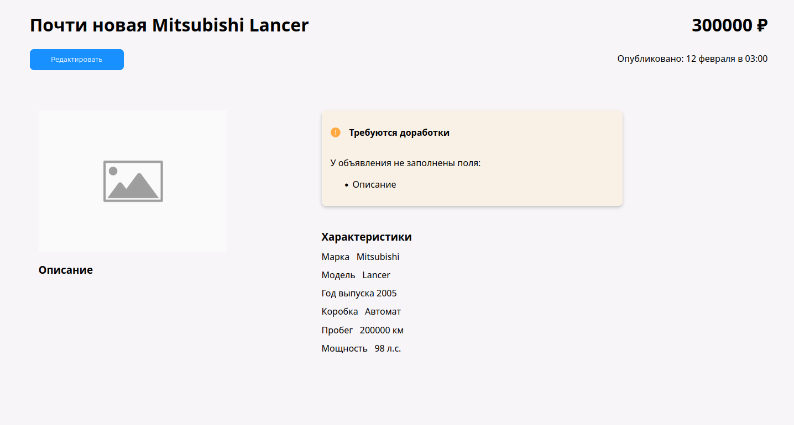
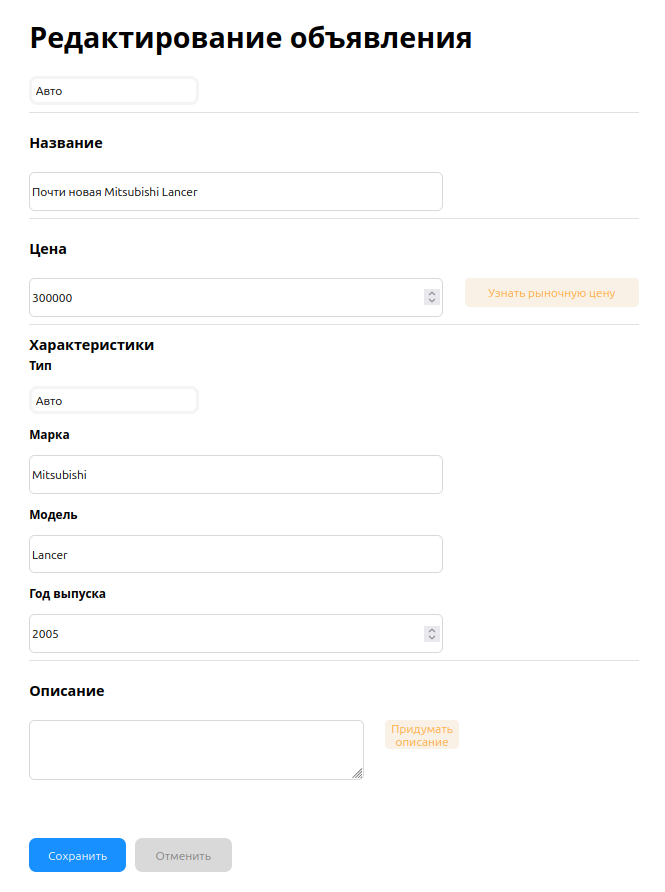

# Проект: МВП Авито

## Стек
Для написания тестового я использовала:
- **Frontend:** React, TypeScript
- **Архитектура:** Feature-Sliced Design (FSD)
- **Стейт-менеджмент:** React Hooks (useState, useEffect, useMemo)
- **Стилизация:** CSS
- **API-клиент:** Axios
- **ИИ-интеграция:** Google Gemini API
- **FSD-архитектура**
- **Линтеры** - eslint, prettier
## Реализованный функционал
- **Read:** Просмотр списка объявлений и детальной карточки
- **Update:** Редактирование существующих объявлений на форме
- **Роутинг**(2 страницы)
- **Сортировка, фильтрация, поиск**
- **Отдельная карточка товара**
### Фильтрация
- Фильтрация объявлений по категориям (авто, недвижимость, электроника)
- Фильтрация по цене, названию и другим параметрам, кроме фильтрации по цене

### Переключение режимов отображения
- Два режима просмотра списка объявлений: **сетка (grid)** и **список (list)**

### ИИ-ассистент (Google Gemini)
- Интегрирован помощник на базе **Google Gemini API**
- Помогает пользователю заполнять объявления: подсказывает название, описание, характеристики

### Запустить приложение:
- Зайти в директорию server, установить зависимости:
```
cd server
npm install
```
- Запустить сервер на порту 8080:
```
Для Linux/macOS: PORT=8080 npm start
Для Windows: set PORT=8080&&npm start
```

- Зайти в корневую директорию для запуска клиентской части(фронтенд):
```
npm install
npm run dev
```

<details>
  <summary>Посмотреть скриншоты интерфейса</summary>
  
  ### Главная страница с товарами
  

  ### Редактирование товара
  

  ### Форма редактирования
  
  
</details>